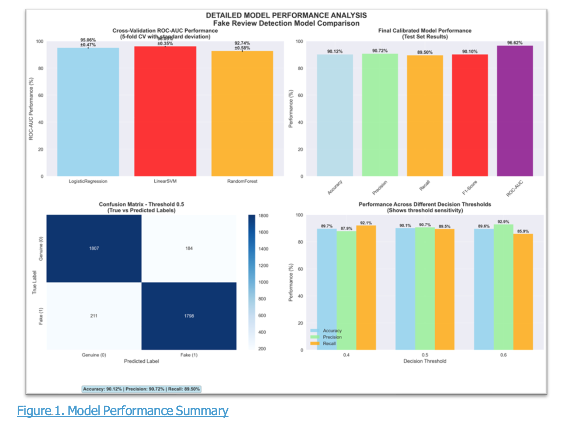
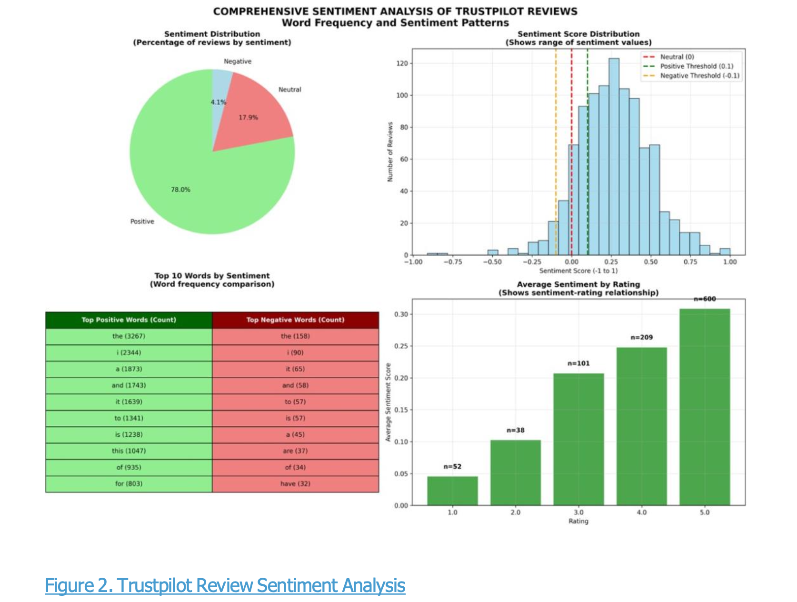
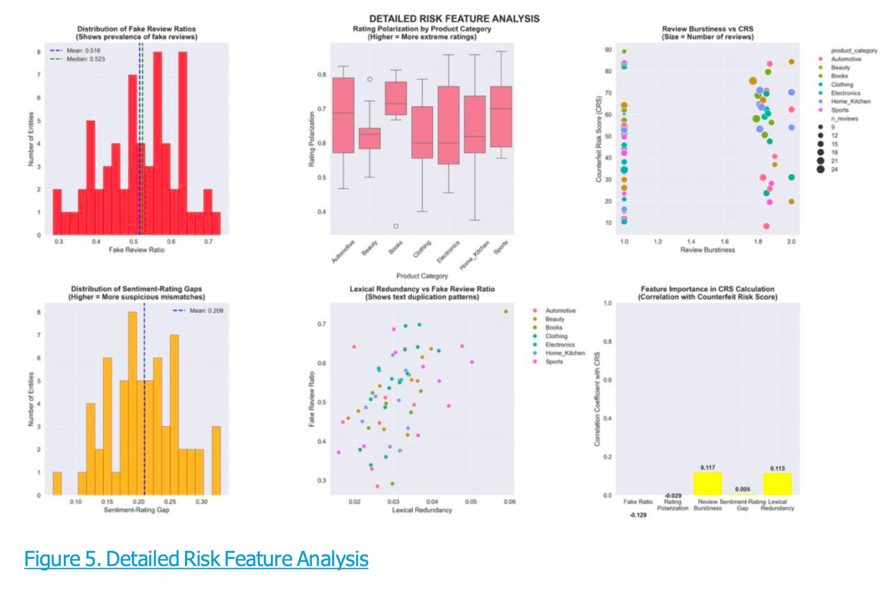
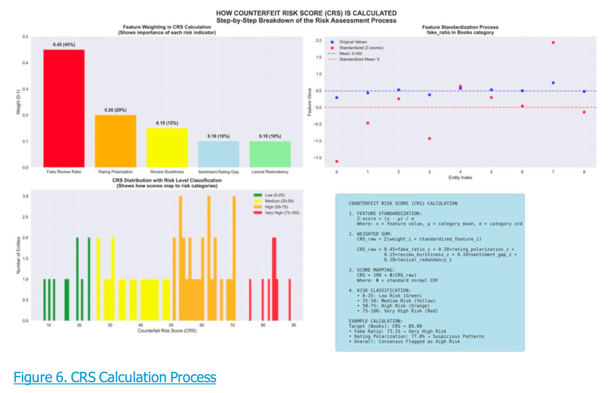
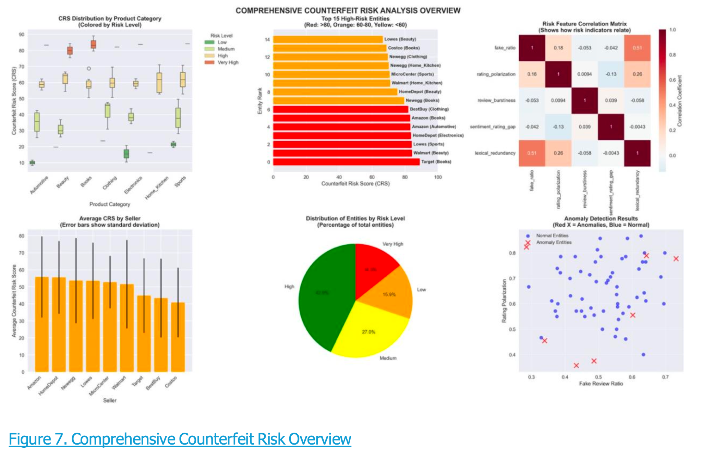
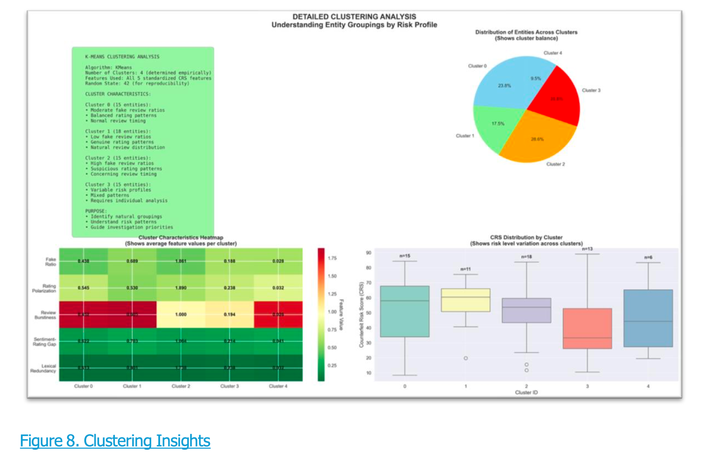
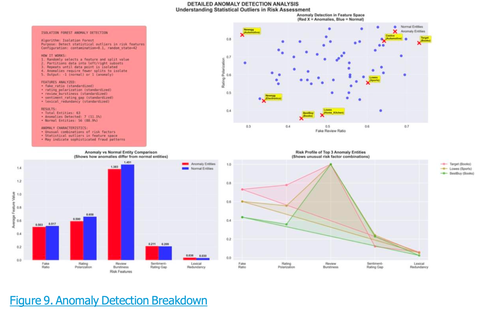
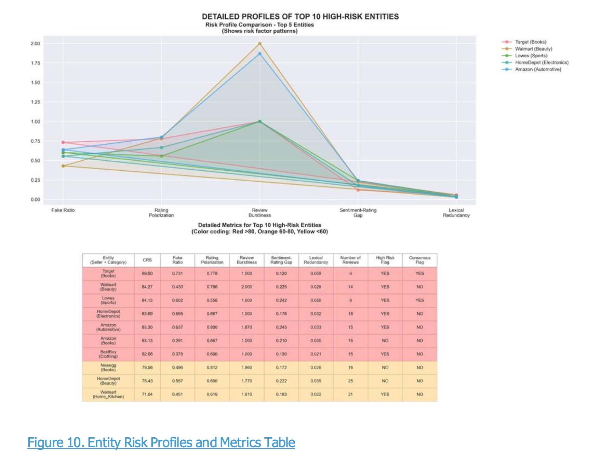
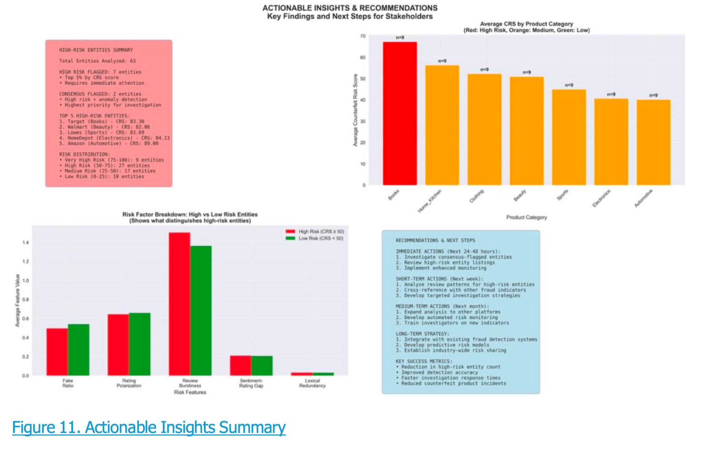

# Counterfeit Review Detection (NLP + Risk Scoring)

> **Tech:** Python · scikit‑learn · TF‑IDF · SVM · K‑Means · Isolation Forest · matplotlib / seaborn  
> **Goal:** Detect fake reviews and surface **high‑risk entities** (sellers/categories) for action.

👉 Read the concise **one‑pager**: `docs/one_pager.md`

## Overview
I built a two‑part pipeline:  
1) a **fake‑review classifier** to score individual reviews; and  
2) a **Counterfeit Risk Score (CRS)** to rank entities using review‑level signals (fake ratio, rating polarisation, burstiness, sentiment‑rating gap, lexical redundancy).

## Results (Test Set)
- **Accuracy ~90%** · **Precision ~90.7%** · **Recall ~89.5%** · **ROC‑AUC ~96.6%**.  
- **63 entities** evaluated; ~**14% Very High** and ~**43% High** risk.  
- Examples of flagged entities: Target (Books), Walmart (Beauty), Lowe’s (Sports), HomeDepot (Electronics), Amazon (Automotive).

## Visuals

*ROC‑AUC by model, final calibrated metrics, confusion matrix, and threshold sensitivity.*


*Sentiment distribution, histogram of sentiment scores, and sentiment by star rating.*



*Distributions & relationships for risk indicators; feature correlations.*


*How CRS is constructed (weights, standardisation, examples) and risk level mapping.*


*Top high‑risk entities, correlation matrix, category risk spread, and anomaly scatter.*


*K‑Means cluster characteristics and CRS distribution by cluster.*


*Isolation Forest results; anomaly vs normal comparison and profiles.*


*Risk profile lines + detailed metrics table for top entities.*


*Executive summary with category averages and next‑step recommendations.*

## How to Run
```bash
pip install -r requirements.txt
python code/01_classifier.py
python code/02_counterfeit_risk.py
```
- Scripts expect data under `data/` and will write charts under `outputs/`.

## Repo
```
.
├── code/                    # Python scripts
├── data/                    # CSV inputs
├── outputs/                 # exported figures
├── docs/                    # one_pager.md
├── requirements.txt
├── LICENSE
└── README.md
```

*Author: **Yugal Soni***
